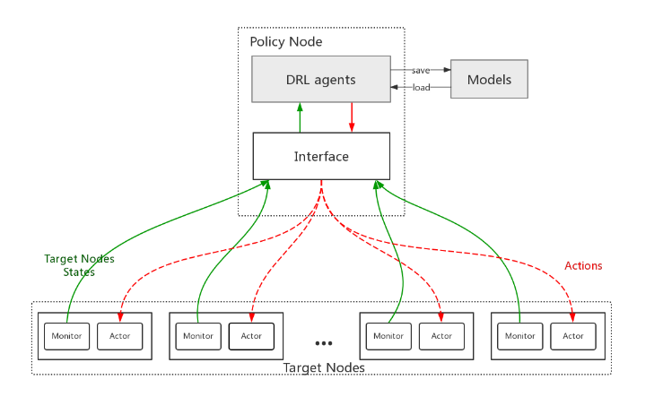

# Intro

Code accompanying the HPC CHINA 2018 paper:
"Performance Optimization of Lustre File System Based on Reinforcement Learning".
Based on data access characteristics of high energy physics calculation,
we propose an automated parameter tuning method using the reinforcement learning.



## Dependencies

Python:

- Pytorch 0.4
- [Zeromq](http://zeromq.org/)
- Numpy
- Matplotlib

[IOzone](http://www.iozone.org/)

## How to Use

The `storage_drl` directory should be placed on the target nodes, and `storage_drl_agents` directory should be placed on the policy node.

On the policy node, use `drl.sh` to start agent, you can choose agents here.
For example,

```
./drl.sh start ppo
```

Stop agent:

```
./drl.sh stop
```

Observe agent's state:

```
./drl.sh status
```

On the target nodes, use `lustre.sh` to start monitor and actor.
For example,

```
./lustre.sh start
```

Others ibid.

## Test

You should use IOzone to initiate cluster testing, for this you need to configure password-free login between nodes.
Once you configure these, the `drl_test` directory should be placed on the test initiator node, then use

```
./iozone.sh start
```

Others ibid.

## Log

The running process will be recorded in the log directory, you can observe the log file for debugging.
The log format is as follows:

```
[ 2018-06-19 19:35:35,192 - ppo ]  -  received {'states': [0.0, 50364416.0, 0.0, 0.0, 0.0, 0.0, 3051.0, 22175142.0, 22175142.0, 0.0, 39317504.0, 0.0, 0.0, 0.0, 0.0, 2468.0, 4915496.0, 4915496.0, 0.0, 70311936.0, 0.0, 0.0, 0.0, 0.0, 2721.0, 8694652.0, 8694652.0, 0.0, 86302720.0, 0.0, 0.0, 0.0, 0.0, 998.0, 18650515.0, 18650515.0, 0.0, 41377792.0, 0.0, 0.0, 0.0, 0.0, 3532.0, 9820971.0, 9820971.0, 0.0, 40869888.0, 0.0, 0.0, 0.0, 0.0, 7159.0, 4780955.0, 4780955.0, 0.0, 79081472.0, 0.0, 0.0, 0.0, 0.0, 901.0, 25180824.0, 25180824.0, 0.0, 82411520.0, 0.0, 0.0, 0.0, 0.0, 2199.0, 40397523.0, 40397523.0, 0.0, 75210752.0, 0.0, 0.0, 0.0, 0.0, 6964.0, 1817595.0, 1817595.0, 0.0, 80928768.0, 0.0, 0.0, 0.0, 0.0, 1495.0, 527019.0, 527019.0, 0.0, 74575872.0, 0.0, 0.0, 0.0, 0.0, 9865.0, 3865213.0, 3865213.0, 0.0, 49229824.0, 0.0, 0.0, 0.0, 0.0, 2228.0, 17157236.0, 17157236.0, 0.0, 78893056.0, 0.0, 0.0, 0.0, 0.0, 4611.0, 5746131.0, 5746131.0, 0.0, 41152512.0, 0.0, 0.0, 0.0, 0.0, 3320.0, 8740776.0, 8740776.0, 0.0, 82092032.0, 0.0, 0.0, 0.0, 0.0, 9060.0, 3816115.0, 3816115.0, 0.0, 38621184.0, 0.0, 0.0, 0.0, 0.0, 1973.0, 7240485.0, 7240485.0, 0.0, 38486016.0, 0.0, 0.0, 0.0, 0.0, 33353.0, 11697863.0, 11697863.0, 0.0, 77275136.0, 0.0, 0.0, 0.0, 0.0, 1120.0, 8042394.0, 8042394.0, 0.0, 72835072.0, 0.0, 0.0, 0.0, 0.0, 6843.0, 6022215.0, 6022215.0, 0.0, 35414016.0, 0.0, 0.0, 0.0, 0.0, 3710.0, 7993143.0, 7993143.0, 0.0, 36880384.0, 0.0, 0.0, 0.0, 0.0, 13861.0, 1998617.0, 1998617.0, 0.0, 80691200.0, 0.0, 0.0, 0.0, 0.0, 1247.0, 2846486.0, 2846486.0, 0.0, 0.0, 0.0, 0.0, 0.0, 0.0, 1280.0, 1280.0, 2077.0], 'reward': 0.0, 'name': 'lustre_lustretest1'} from lustre_lustretest1
[ 2018-06-19 19:35:35,201 - ppo ]  -  send 5 to lustre_lustretest1
```
